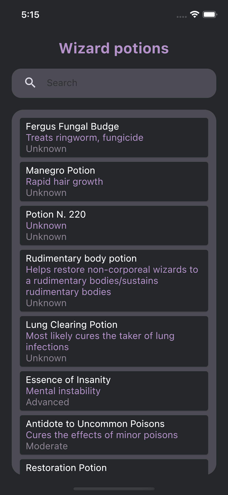
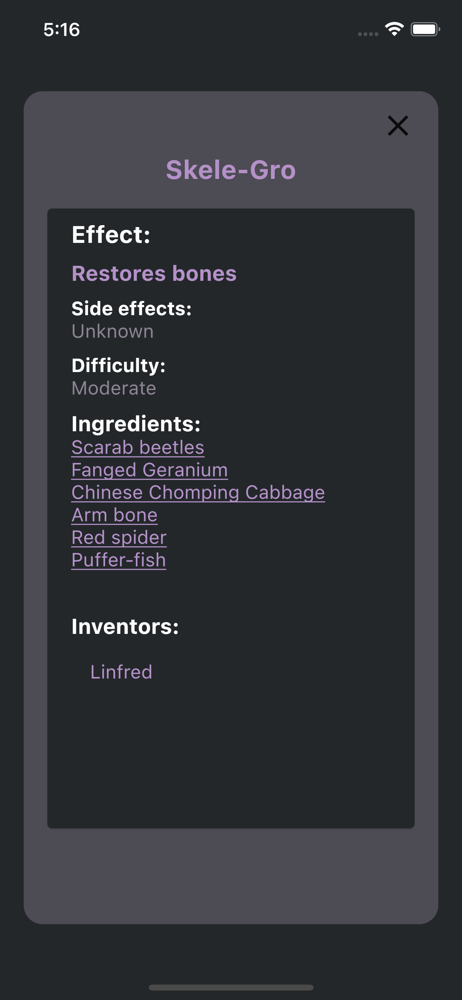
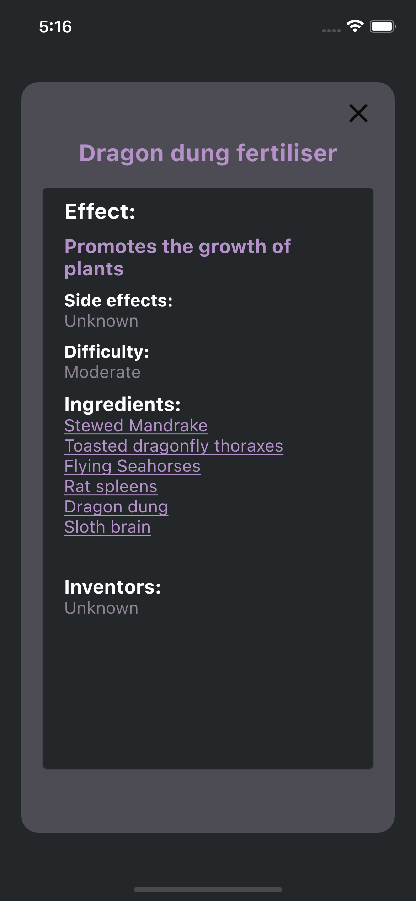
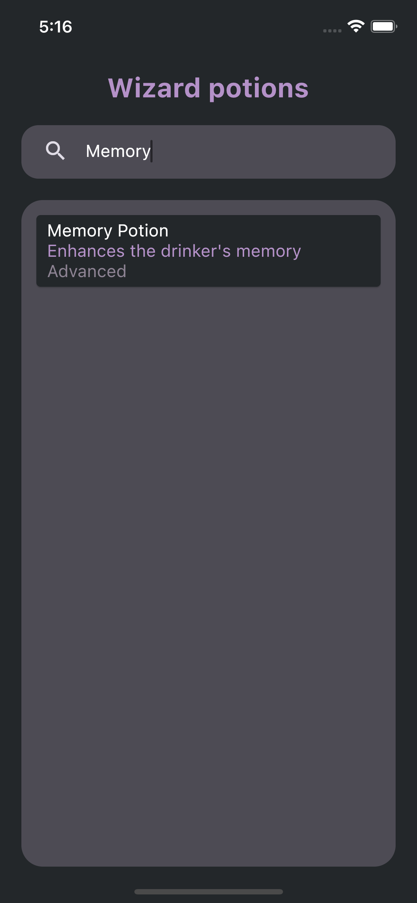
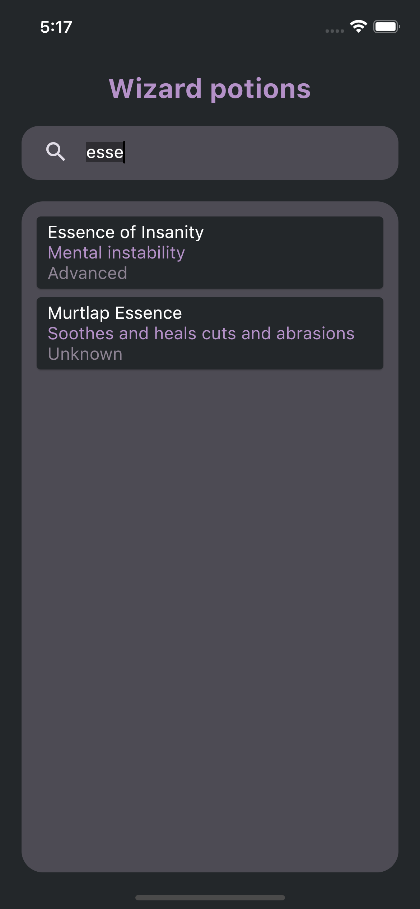

# Search Input

A basic application consisting of two screens - a list view and a detail view. 
Wizard potions list.

## API used

[Harry Potter wizard world API](https://wizard-world-api.herokuapp.com/swagger/index.html)

## Packages used

* provider: ^6.0.5
* http: ^0.13.5

## App's screens

